# SQL Basics

- SELECT: Is used to select data from a database
~~~sql
SELECT * FROM Customers;

SELECT cus.CustomerName,cus.City, cus.PostalCode FROM Customers AS cus;
~~~

- SELECT DISTINCT: Is used to return only distinct (different) values
~~~sql
SELECT Country FROM Customers;
SELECT COUNT(Country) FROM Customers;

SELECT DISTINCT Country FROM Customers;
SELECT COUNT(DISTINCT Country) FROM Customers;

SELECT Count(*) AS DistinctCountries
FROM (SELECT DISTINCT Country FROM Customers);
~~~

- WHERE: Is used to filter records
~~~sql
SELECT * FROM Customers
WHERE Country='Mexico';

SELECT * FROM Customers
WHERE Country is 'Mexico';

SELECT * FROM Customers
WHERE Country is not 'Mexico';

SELECT * FROM Customers
WHERE CustomerName like '%Alfre%'

SELECT * FROM Customers
WHERE City IN ('Paris','London');

SELECT * FROM Products
WHERE Price BETWEEN 40 AND 60;
~~~

- AND, OR and NOT Operators
    - The AND operator displays a record if all the conditions separated by AND are TRUE
    - The OR operator displays a record if any of the conditions separated by OR is TRUE
~~~sql
SELECT * FROM Customers
WHERE Country='Germany' AND City='Berlin';

SELECT * FROM Customers
WHERE City='Berlin' OR City='München';

SELECT * FROM Customers
WHERE NOT Country='Germany';
~~~

- ORDER BY: Is used to sort the result-set in ascending or descending order
~~~sql
SELECT * FROM Customers
ORDER BY City DESC;

SELECT * FROM Customers
ORDER BY City;

SELECT * FROM Customers
ORDER BY ContactName,CustomerID;
~~~

- INSERT INTO: Is used to insert new records in a table
~~~sql
INSERT INTO Customers (CustomerName, ContactName, Address, City, PostalCode, Country)
VALUES ('Cardinal', 'Tom B. Erichsen', 'Skagen 21', 'Stavanger', '4006', 'Norway');
~~~

- NULL values
~~~sql
SELECT CustomerName, ContactName, Address
FROM Customers
WHERE Address IS NULL;

SELECT CustomerName, ContactName, Address
FROM Customers
WHERE Address IS NOT NULL;
~~~

- UPDATE: Is used to modify the existing records in a table
~~~sql
UPDATE Customers
SET ContactName = 'Alfred Schmidt', City= 'Frankfurt'
WHERE CustomerID = 1;

UPDATE Customers
SET ContactName='Juan'
WHERE Country='Mexico';
~~~

- Be careful when updating records. If you omit the WHERE clause, ALL records will be updated!
~~~sql
UPDATE Customers
SET ContactName='Juan';
~~~

- DELETE: Is used to delete existing records in a table
~~~sql
DELETE FROM Customers WHERE CustomerName='Alfreds Futterkiste';

DELETE FROM Customers;
~~~
 
- SELECT TOP: Is used to specify the number of records to return
- Not all database systems support the SELECT TOP clause. MySQL supports the LIMIT clause to select a limited number of records, while Oracle uses FETCH FIRST n ROWS ONLY and ROWNUM
~~~sql
SELECT TOP 3 * FROM Customers;

SELECT * FROM Customers
LIMIT 3;

SELECT * FROM Customers
FETCH FIRST 3 ROWS ONLY;

SELECT TOP 3 * FROM Customers
WHERE Country='Germany';

SELECT * FROM Customers
WHERE Country='Germany'
LIMIT 3;

SELECT * FROM Customers
WHERE Country='Germany'
FETCH FIRST 3 ROWS ONLY;
~~~

- MIN() and MAX() 
    - The MIN() function returns the smallest value of the selected column
    - The MAX() function returns the largest value of the selected column
~~~sql
SELECT MIN(Price) AS SmallestPrice
FROM Products;

SELECT MAX(Price) AS LargestPrice
FROM Products;
~~~

- COUNT(), AVG() and SUM()
    - COUNT() function returns the number of rows that matches a specified criterion
    - AVG() function returns the average value of a numeric column
    - SUM() function returns the total sum of a numeric column
~~~sql
SELECT COUNT(ProductID)
FROM Products;

SELECT AVG(Price)
FROM Products;

SELECT SUM(Quantity)
FROM OrderDetails;
~~~

- LIKE: Is used in a WHERE clause to search for a specified pattern in a column
~~~sql
SELECT * FROM Customers
WHERE CustomerName LIKE 'b_o%s';

SELECT * FROM Customers
WHERE CustomerName LIKE '_r%';

SELECT * FROM Customers
WHERE CustomerName NOT LIKE 'a%';
~~~

- Wildcards
    - \*	Represents zero or more characters	
    - ?	    Represents a single character	
    - []	Represents any single character within the brackets	
    - !	    Represents any character not in the brackets	
    - \-	Represents any single character within the specified range	
    - \#	Represents any single numeric character
    
~~~sql
SELECT * FROM Customers
WHERE City LIKE 'ber%';

SELECT * FROM Customers
WHERE City LIKE '%es%';

SELECT * FROM Customers
WHERE City LIKE '[bsp]%';

SELECT * FROM Customers
WHERE City LIKE '[!bsp]%';

SELECT * FROM Customers
WHERE City NOT LIKE '[bsp]%';
~~~

- IN Operator 
    - Allows you to specify multiple values in a WHERE clause
    - Is a shorthand for multiple OR conditions
~~~sql
SELECT * FROM Customers
WHERE Country IN ('Germany', 'France', 'UK');

SELECT * FROM Customers
WHERE Country IN (SELECT Country FROM Suppliers);
~~~

- BETWEEN 
    - Selects values within a given range
~~~sql
SELECT * FROM Products
WHERE Price BETWEEN 10 AND 20;

SELECT * FROM Products
WHERE Price BETWEEN 10 AND 20
AND CategoryID NOT IN (1,2,3);

SELECT * FROM Products
WHERE ProductName BETWEEN 'Carnarvon Tigers' AND 'Mozzarella di Giovanni'
ORDER BY ProductName;

SELECT * FROM Orders
WHERE OrderDate BETWEEN '1996-07-01' AND '1996-07-31';
~~~

- Aliases: Are used to give a table, or a column in a table, a temporary name
~~~sql
SELECT CustomerID AS ID, CustomerName AS Customer
FROM Customers;

SELECT CustomerName AS Customer, ContactName AS [Contact Person]
FROM Customers;

SELECT CustomerName, Address + ', ' + PostalCode + ' ' + City + ', ' + Country AS Address
FROM Customers;

SELECT Orders.OrderID, Orders.OrderDate, Customers.CustomerName
FROM Customers, Orders
WHERE Customers.CustomerName='Around the Horn' AND Customers.CustomerID=Orders.CustomerID;

SELECT o.OrderID, o.OrderDate, c.CustomerName
FROM Customers AS c, Orders AS o
WHERE c.CustomerName='Around the Horn' AND c.CustomerID=o.CustomerID;
~~~

- Joins: Is used to combine rows from two or more tables, based on a related column between them
    - (INNER) JOIN: Returns records that have matching values in both tables
    - LEFT (OUTER) JOIN: Returns all records from the left table, and the matched records from the right table
    - RIGHT (OUTER) JOIN: Returns all records from the right table, and the matched records from the left table
    - FULL (OUTER) JOIN: Returns all records when there is a match in either left or right table
~~~sql
SELECT *
FROM Orders AS o
INNER JOIN Customers AS c
ON o.CustomerID=c.CustomerID;
~~~

- INNER JOIN: Selects records that have matching values in both tables
~~~sql
SELECT Orders.OrderID, Customers.CustomerName, Shippers.ShipperName
FROM ((Orders
INNER JOIN Customers ON Orders.CustomerID = Customers.CustomerID)
INNER JOIN Shippers ON Orders.ShipperID = Shippers.ShipperID);
~~~

- LEFT JOIN: 
    - Returns all records from the left table (table1), and the matching records from the right table (table2) 
    - The result is 0 records from the right side, if there is no match
~~~sql
SELECT Customers.CustomerName, Orders.OrderID
FROM Customers
LEFT JOIN Orders ON Customers.CustomerID = Orders.CustomerID
ORDER BY Customers.CustomerName;

SELECT *
FROM Customers
LEFT JOIN Orders
ON Customers.CustomerID=Orders.CustomerID
WHERE Orders.ShipperID is not null
ORDER BY Customers.CustomerName;
~~~

- RIGHT JOIN:
    - Returns all records from the right table (table2), and the matching records from the left table (table1) 
    - The result is 0 records from the left side, if there is no match
~~~sql
SELECT Orders.EmployeeID ,Orders.OrderID, Employees.LastName, Employees.FirstName
FROM Orders
RIGHT JOIN Employees
ON Orders.EmployeeID = Employees.EmployeeID
WHERE Orders.EmployeeID is not null
ORDER BY Orders.OrderID;
~~~

- FULL OUTER JOIN:
    - Returns all records when there is a match in left (table1) or right (table2) table records
~~~sql
SELECT Customers.CustomerName, Orders.OrderID
FROM Customers
FULL OUTER JOIN Orders ON Customers.CustomerID=Orders.CustomerID
ORDER BY Customers.CustomerName;
~~~

- Self Join: Self join is a regular join, but the table is joined with itself.
~~~sql
SELECT A.CustomerName AS CustomerName1, B.CustomerName AS CustomerName2, A.City
FROM Customers A, Customers B
WHERE A.CustomerID <> B.CustomerID
AND A.City = B.City
ORDER BY A.City;

select * from
customer as c1, customer as c2
-- 36 records

select c1.id as customer_id, c1.name as customer_name, c2.name as supervisor_name from
customer as c1
LEFT JOIN
customer as c2
ON
c1.sup_id = c2.id
-- 6 records
~~~

- UNION 
    - Is used to combine the result-set of two or more SELECT statements
    - Every SELECT statement within UNION must have the same number of columns
    - The columns must also have similar data types
    - The columns in every SELECT statement must also be in the same order
    - The UNION operator selects only distinct values by default. To allow duplicate values, use UNION ALL

- The following SQL statement returns the cities (only distinct values) from both the "Customers" and the "Suppliers" table
~~~sql
SELECT City FROM Customers
UNION
SELECT City FROM Suppliers
ORDER BY City;
~~~

- The following SQL statement returns the cities (duplicate values also) from both the "Customers" and the "Suppliers" table
~~~sql
SELECT City FROM Customers
UNION ALL
SELECT City FROM Suppliers
ORDER BY City;
~~~

- So, here we have created a temporary column named "Type", that list whether the contact person is a "Customer" or a "Supplier"
~~~sql
SELECT 'Customer' AS Type, ContactName, City, Country
FROM Customers
UNION
SELECT 'Supplier', ContactName, City, Country
FROM Suppliers
~~~

- GROUP BY: Groups rows that have the same values into summary rows
~~~sql
SELECT COUNT(CustomerID), Country
FROM Customers
GROUP BY Country;

SELECT COUNT(CustomerID), Country
FROM Customers
GROUP BY Country
ORDER BY COUNT(CustomerID);

SELECT Shippers.ShipperName, COUNT(Orders.OrderID) AS NumberOfOrders FROM Orders
LEFT JOIN Shippers ON Orders.ShipperID = Shippers.ShipperID
GROUP BY ShipperName;
~~~

- HAVING: HAVING clause was added to SQL because the WHERE keyword cannot be used with aggregate functions
~~~sql
-- The following SQL statement lists the number of customers in each country. Only include countries with more than 5 customers
SELECT COUNT(CustomerID), Country
FROM Customers
GROUP BY Country
HAVING COUNT(CustomerID) < 5;

-- The following SQL statement lists the number of customers in each country, sorted high to low (Only include countries with more than 5 customers)
SELECT COUNT(CustomerID), Country
FROM Customers
GROUP BY Country
HAVING COUNT(CustomerID) > 5
ORDER BY COUNT(CustomerID);

-- The following SQL statement lists the employees that have registered more than 10 orders
SELECT Employees.LastName, COUNT(Orders.OrderID) AS NumberOfOrders
FROM (Orders
INNER JOIN Employees ON Orders.EmployeeID = Employees.EmployeeID)
GROUP BY LastName
HAVING COUNT(Orders.OrderID) > 10;

-- The following SQL statement lists if the employees "Davolio" or "Fuller" have registered more than 25 orders
SELECT Employees.LastName, COUNT(Orders.OrderID) AS NumberOfOrders
FROM Orders
INNER JOIN Employees ON Orders.EmployeeID = Employees.EmployeeID
WHERE LastName = 'Davolio' OR LastName = 'Fuller'
GROUP BY LastName
HAVING COUNT(Orders.OrderID) > 25;
~~~

- EXISTS
    - The EXISTS operator is used to test for the existence of any record in a subquery
    - The EXISTS operator returns TRUE if the subquery returns one or more records
~~~sql
-- The following SQL statement returns TRUE and lists the suppliers with a product price less than 20
SELECT SupplierName
FROM Suppliers
WHERE EXISTS (SELECT ProductName FROM Products WHERE Products.SupplierID = Suppliers.supplierID AND Price < 20);

-- The following SQL statement returns TRUE and lists the suppliers with a product price equal to 22
SELECT SupplierName
FROM Suppliers
WHERE EXISTS (SELECT ProductName FROM Products WHERE Products.SupplierID = Suppliers.supplierID AND Price = 22);

~~~
    
- SQL ANY
    - Returns a boolean value as a result
    - Returns TRUE if ANY of the sub query values meet the condition
~~~sql
SELECT ProductName
FROM Products
WHERE ProductID = ANY
  (SELECT ProductID
  FROM OrderDetails
  WHERE Quantity = 10);

SELECT ProductName
FROM Products
WHERE ProductID = ANY
  (SELECT ProductID
  FROM OrderDetails
  WHERE Quantity > 1000);
~~~
        
- SQL ALL
    - Returns a boolean value as a result
    - Returns TRUE if ALL of the sub query values meet the condition
    - Is used with SELECT, WHERE and HAVING statements
~~~sql
-- The following SQL statement lists the ProductName if ALL the records in the OrderDetails table has Quantity equal to 10. This will of course return FALSE because the Quantity column has many different values (not only the value of 10)
SELECT ProductName 
FROM Products
WHERE ProductID = ALL (SELECT ProductID FROM OrderDetails WHERE Quantity = 10);
~~~

- SELECT INTO: Statement copies data from one table into a new table
~~~sql
SELECT * INTO CustomersBackup
FROM Customers;

SELECT CustomerName, ContactName INTO CustomersBackup
FROM Customers;

SELECT Customers.CustomerName, Orders.OrderID
INTO CustomersOrderBackup2017
FROM Customers
LEFT JOIN Orders ON Customers.CustomerID = Orders.CustomerID;

SELECT * INTO newtable
FROM oldtable
WHERE 1 = 0;
~~~

- INSERT INTO SELECT: 
    - Statement copies data from one table and inserts it into another table
    - Requires that the data types in source and target tables match

~~~sql
-- If the table is created with same schema then can insert values from source table to target table
INSERT INTO customer_bk
SELECT * FROM customer

-- The following SQL statement copies "Suppliers" into "Customers" (the columns that are not filled with data, will contain NULL)
INSERT INTO Customers (CustomerName, City, Country)
SELECT SupplierName, City, Country FROM Suppliers;

INSERT INTO Customers (CustomerName, ContactName, Address, City, PostalCode, Country)
SELECT SupplierName, ContactName, Address, City, PostalCode, Country FROM Suppliers;
~~~

- CASE Expressions
    - The CASE expression goes through conditions and returns a value when the first condition is met 
    - So, once a condition is true, it will stop reading and return the result
    - If no conditions are true, it returns the value in the ELSE clause
    - If there is no ELSE part and no conditions are true, it returns NULL
~~~sql
CASE
    WHEN condition1 THEN result1
    WHEN condition2 THEN result2
    WHEN conditionN THEN resultN
    ELSE result
END;

SELECT  Quantity,
CASE 
WHEN Quantity = 10 THEN OrderID
ELSE 'Quantity not equals to 10'
END AS QuantityText
FROM OrderDetails;

SELECT CustomerName, City, Country FROM Customers
ORDER BY (CASE
WHEN City IS NULL THEN Country
ELSE City
END);
~~~

- IFNULL(): Function lets you return an alternative value if an expression is NULL
~~~sql
SELECT ProductName, UnitPrice * (UnitsInStock + IFNULL(UnitsOnOrder, 0))
FROM Products;
~~~

- ISNULL(): Function lets you return an alternative value when an expression is NULL
~~~sql
SELECT ProductName, UnitPrice * (UnitsInStock + ISNULL(UnitsOnOrder, 0))
FROM Products;
~~~

# SQL DataBase

- CREATE DATABASE
~~~sql
CREATE DATABASE testDB;
SHOW DATABASES;
~~~

- DROP DATABASE
~~~sql
DROP DATABASE testDB;
~~~

- CREATE TABLE
~~~sql
CREATE TABLE Persons2
(
PersonID int,
LastName varchar(255),
FirstName varchar(255),
Address varchar(255),
City varchar(255)
);

CREATE TABLE TestTable AS
SELECT customername, contactname
FROM customers;
~~~

- DROP TABLE: Is used to drop an existing table in a database
~~~sql
DROP TABLE Shippers;
~~~

- TRUNCATE TABLE: Is used to delete the data inside a table, but not the table itself
~~~sql
TRUNCATE TABLE Persons;
~~~

- ALTER TABLE
    - The ALTER TABLE statement is used to add, delete, or modify columns in an existing table
    - The ALTER TABLE statement is also used to add and drop various constraints on an existing table
~~~sql
ALTER TABLE Customers
ADD Email varchar(255);

ALTER TABLE Customers
DROP COLUMN Email;

ALTER TABLE Customers
RENAME COLUMN Email to WorkEmail;
~~~

- SQL Constraints
    - Constraints are used to limit the type of data that can go into a table. This ensures the accuracy and reliability of the data in the table. If there is any violation between the constraint and the data action, the action is aborted.
~~~txt
NOT NULL - Ensures that a column cannot have a NULL value
UNIQUE - Ensures that all values in a column are different
PRIMARY KEY - A combination of a NOT NULL and UNIQUE. Uniquely identifies each row in a table
FOREIGN KEY - Prevents actions that would destroy links between tables
CHECK - Ensures that the values in a column satisfies a specific condition
DEFAULT - Sets a default value for a column if no value is specified
CREATE INDEX - Used to create and retrieve data from the database very quickly
~~~

- NOT NULL
~~~sql
CREATE TABLE Persons (
    Id int NOT NULL,
    LastName varchar(255) NOT NULL,
    FirstName varchar(255) NOT NULL,
    Age int
);

ALTER TABLE Persons
ALTER COLUMN Age int NOT NULL;
~~~

- UNIQUE
    - The UNIQUE constraint ensures that all values in a column are different
~~~sql
CREATE TABLE Persons (
    ID int NOT NULL UNIQUE,
    LastName varchar(255) NOT NULL,
    FirstName varchar(255),
    Age int
);

ALTER TABLE Persons
ADD UNIQUE (ID);

ALTER TABLE Persons
DROP CONSTRAINT UC_Person;
~~~

- PRIMARY
    - Primary keys must contain UNIQUE values, and cannot contain NULL values
~~~sql
CREATE TABLE Persons (
    ID int NOT NULL,
    LastName varchar(255) NOT NULL,
    FirstName varchar(255),
    Age int,
    PRIMARY KEY (ID)
);

ALTER TABLE Persons
ADD PRIMARY KEY (ID);

ALTER TABLE Persons
ADD CONSTRAINT PK_Person PRIMARY KEY (ID,LastName);

ALTER TABLE Persons
DROP CONSTRAINT PK_Person;
~~~

- FOREIGN KEY
~~~sql
CREATE TABLE Orders (
    OrderID int NOT NULL PRIMARY KEY,
    OrderNumber int NOT NULL,
    PersonID int FOREIGN KEY REFERENCES Persons(PersonID)
);

ALTER TABLE Orders
ADD FOREIGN KEY (PersonID) REFERENCES Persons(PersonID);

ALTER TABLE Orders
DROP CONSTRAINT FK_PersonOrder;
~~~

- CHECK
    - The CHECK constraint is used to limit the value range that can be placed in a column
~~~sql
CREATE TABLE Persons (
    ID int NOT NULL,
    LastName varchar(255) NOT NULL,
    FirstName varchar(255),
    Age int CHECK (Age>=18 && Age is not null)
);

ALTER TABLE Persons
ADD CONSTRAINT CHK_PersonAge CHECK (Age>=18 AND City='Sandnes');

ALTER TABLE Persons
DROP CONSTRAINT CHK_PersonAge;
~~~

- DEFAULT
~~~sql
CREATE TABLE Persons (
    ID int NOT NULL,
    LastName varchar(255) NOT NULL,
    FirstName varchar(255),
    Age int,
    City varchar(255) DEFAULT 'Sandnes'
);

ALTER TABLE Persons
ALTER City SET DEFAULT 'Sandnes';

ALTER TABLE Persons
ALTER COLUMN City DROP DEFAULT;
~~~

- CREATE INDEX
~~~sql
CREATE INDEX idx_lastname
ON Persons (LastName);

ALTER TABLE Persons
DROP INDEX idx_lastname;
~~~

- AUTO INCREMENT
~~~sql
CREATE TABLE Persons (
    Personid int NOT NULL AUTO_INCREMENT,
    LastName varchar(255) NOT NULL,
    FirstName varchar(255),
    Age int,
    PRIMARY KEY (Personid)
);
~~~

# UML
- A Class consists of Attributes and Methods
~~~txt
________________
     Animal
________________
-name: string
-id: int
-age: int
________________
-setName(): void
-eat(): void
________________
~~~

- Visibility
    - \- Private: Cannot access by any class or subclass
    - \+ Public: Can be access by any class or subclass
    - \# Protected: Can be access by same class or subclass
    - \~ Default: Can be access as long as their in the same package
    
- Relationship
    - Inheritance
        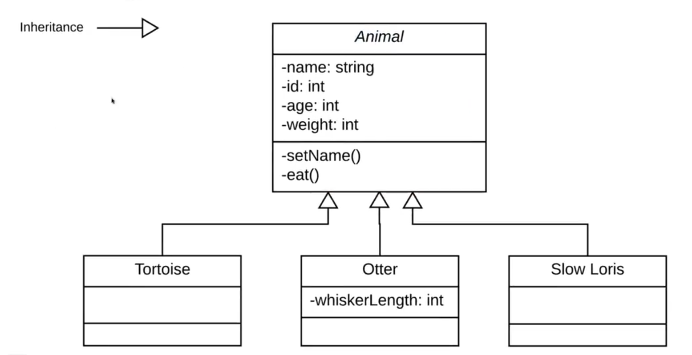
        eg: Tortoise inherits all the attributes and methods from the animal class.(Arrow pointing to parent class)
        
    - Association
        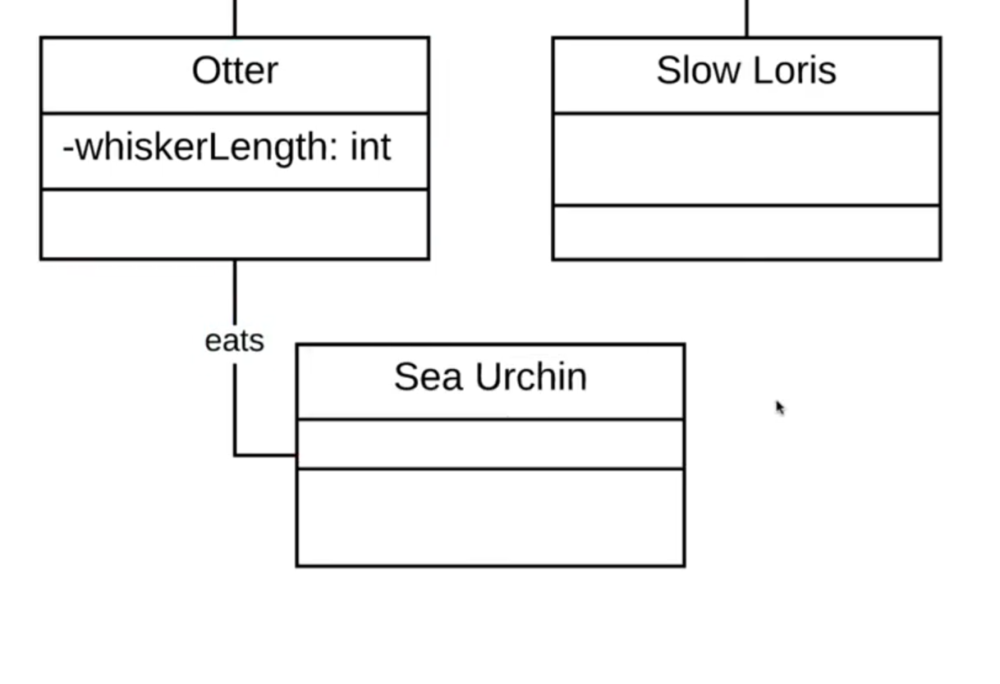
        eg: Otter eats Sea urchin(regular arrow)
        
    - Aggregation
        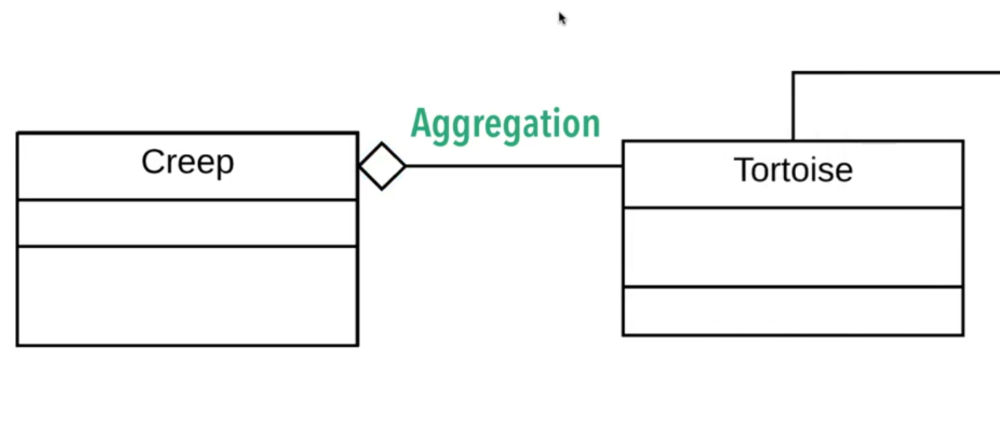
        eg: Part can exist outside the whole. Tortoise pack is known as a Creep. Tortoise can be a part of Creep or it can be separate from the Creep.(Open Diamond)
        
    - Composition
        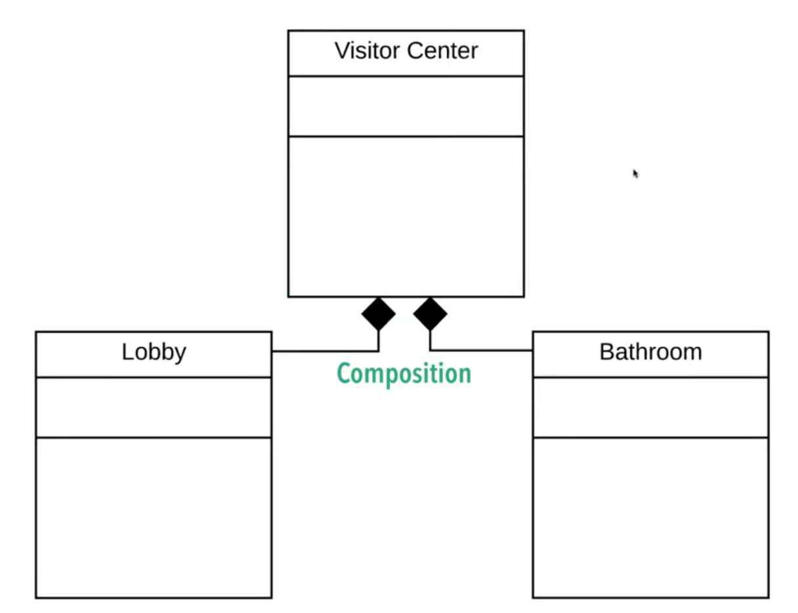
        eg: Part cannot exist outside the whole. Lobby or Bathroom can only be exist inside a Visitor Center(Close Diamond)
        
- Multiplicity
    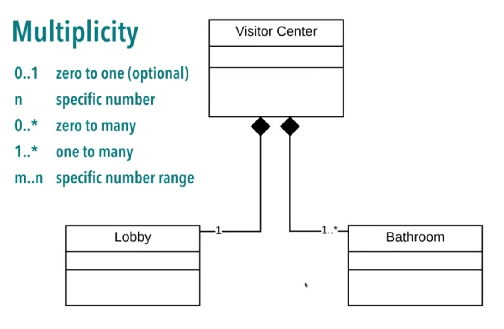
    
- UML Diagram
    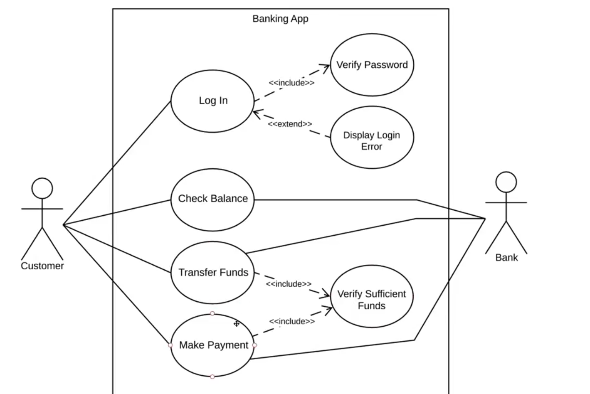
    - System
        - eg: System boundary: Banking App
    - Actors
        - eg: Outside the System boundary: Customer, Bank
    - Use cases
        - Starts with a verb followed by an action
            - eg: Log in, Check Balance, Transfer funds
    - Relationships
        - Association
            - eg: Draws a normal line
        - Include
            - eg: If a base case occurs the include use case happens as well(Dash line from base to include use case)
        - Exclude
            - eg: If a base case occurs the exclude use case might happen sometimes but not all the time(Dash line from exclude to base use case)
        - Generalization(Inheritance)
            - eg: You can pay from checking account or savings account(Arrow from child to parent)
            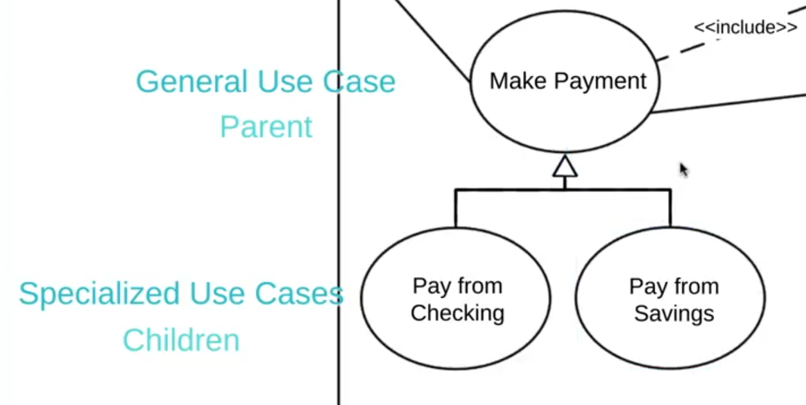
            
- Sequence Diagram
    - ATM Transaction Process
        - Actor - stick figures
            - eg: Customer
        - Objects - Boxes
            - eg: ATM, Bank Server, Bank Account
        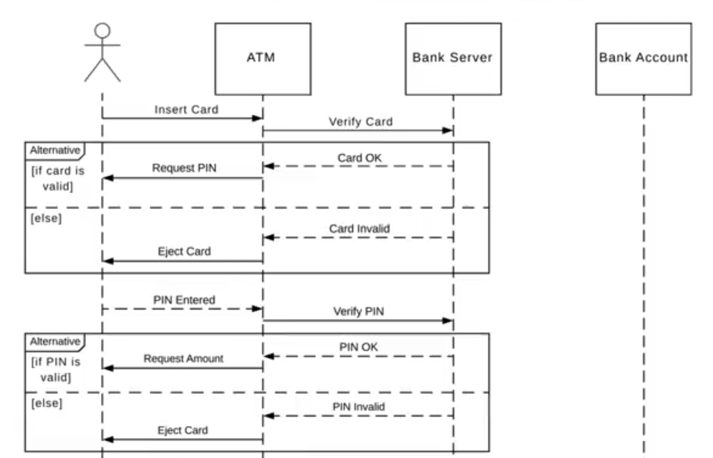
        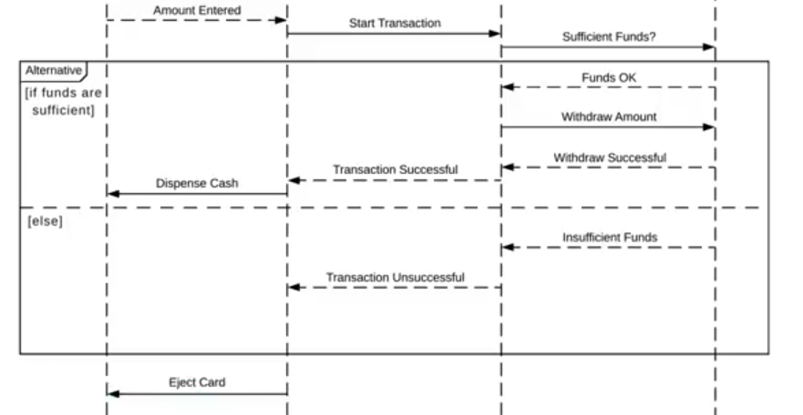
        
- ERD
    - Entities
        - Attributes
        - Cardinality
            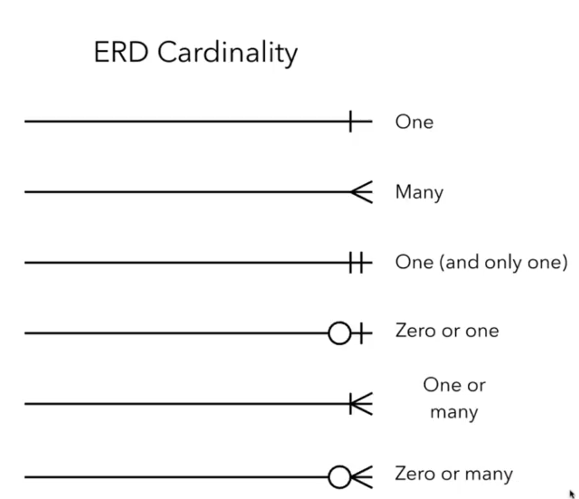
    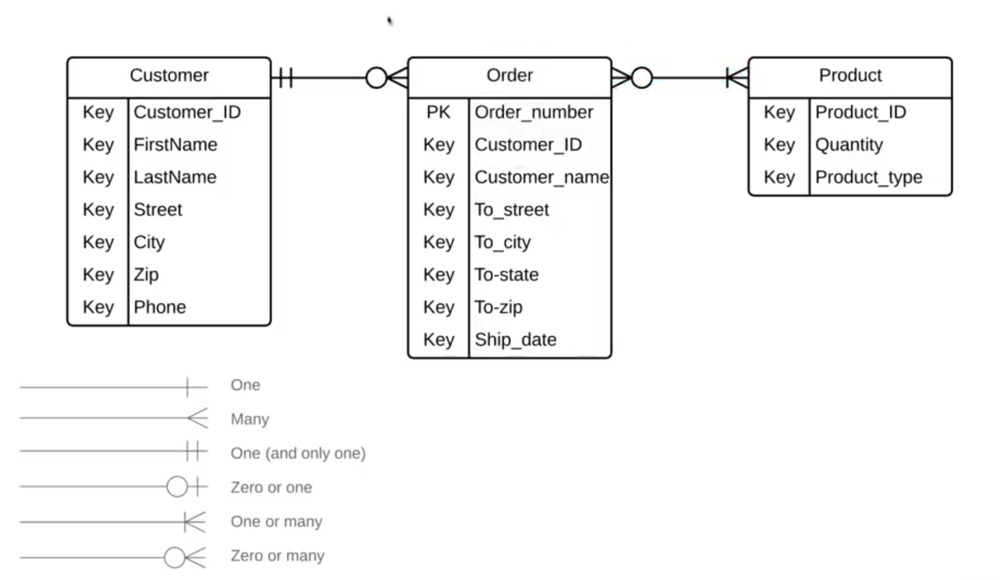
    
    - ER Diagram
    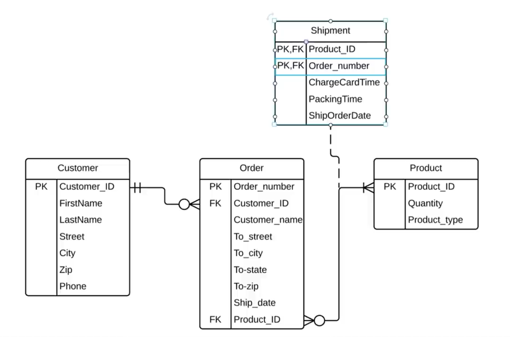
    
~~~sql
CREATE TABLE "Department" (
  "departmentId" int,
  "departmentName" varchar,
  PRIMARY KEY ("departmentId")
);

CREATE TABLE "Course" (
  "courseId" int,
  "courseName" varchar,
  PRIMARY KEY ("courseId")
);

CREATE TABLE "Student" (
  "studentId" int,
  "firstName" varchar,
  "lastName" varchar,
  "age" varchar,
  "departmentId" int,
  PRIMARY KEY ("studentId"),
  CONSTRAINT "FK_Student.departmentId"
    FOREIGN KEY ("departmentId")
      REFERENCES "Department"("departmentId")
);

CREATE TABLE "StudentCourses" (
  "studentId" int,
  "courseId" int,
  CONSTRAINT "FK_StudentCourses.courseId"
    FOREIGN KEY ("courseId")
      REFERENCES "Course"("courseId"),
  CONSTRAINT "FK_StudentCourses.studentId"
    FOREIGN KEY ("studentId")
      REFERENCES "Student"("studentId")
);

CREATE TABLE "ParentsDetail" (
  "parentsDetailId" int,
  "fathersName" varchar,
  "mothersName" varchar,
  "address" varchar,
  "studentId" int,
  PRIMARY KEY ("parentsDetailId")
);
~~~

- SQL Questions
~~~sql
-- Find distinct department count
SELECT COUNT(DISTINCT(D."departmentName")) FROM public."Department" AS D

-- Find student count against department name 
SELECT DISTINCT(D."departmentName") AS dep_name, COUNT(S."departmentId") AS num_of_students 
FROM public."Department" AS D
LEFT JOIN public."Student" AS S
ON S."departmentId" = D."departmentId"
GROUP BY D."departmentName"

-- Total Savings of the students in CS department
SELECT SUM(S."totalSavings") AS total_savings
FROM public."Department" AS D
LEFT JOIN public."Student" AS S
ON S."departmentId" = D."departmentId"
WHERE D."departmentName" = 'CS'

-- Get mothers details and home address for all the students
SELECT S."firstName" AS student_name, P."mothersName" AS mother_name, P."address" AS home_address
FROM public."Student" AS S
LEFT JOIN public."ParentsDetail" AS P
ON S."studentId" = P."studentId" 

-- Find How many courses each student doing along with their names
SELECT S."firstName" AS first_name,S."lastName" AS last_name , COUNT(C."courseName") AS num_of_courses 
FROM public."StudentCourses" AS SC
INNER JOIN public."Student" AS S ON 
SC."studentId" = S."studentId"
INNER JOIN public."Course" AS C ON
SC."courseId" = C."courseId"
GROUP BY S."studentId"
ORDER BY num_of_courses 
~~~

- Inner Queries and Sub Queries

1. Create and Add employees
~~~sql
CREATE TABLE public.employee (
    emp_id bigint NOT NULL,
    emp_name character varying,
    dept_name character varying,
    salary bigint
);
ALTER TABLE public.employee OWNER TO postgres;

INSERT INTO public.employee (emp_id, emp_name, dept_name, salary) VALUES (101, 'Heshan', 'Admin', 4000);
INSERT INTO public.employee (emp_id, emp_name, dept_name, salary) VALUES (102, 'Dilan', 'HR', 2000);
INSERT INTO public.employee (emp_id, emp_name, dept_name, salary) VALUES (103, 'Shihan', 'HR', 5000);
INSERT INTO public.employee (emp_id, emp_name, dept_name, salary) VALUES (104, 'Danu', 'IT', 10000);
INSERT INTO public.employee (emp_id, emp_name, dept_name, salary) VALUES (105, 'Soosa', 'Finance', 1000);
INSERT INTO public.employee (emp_id, emp_name, dept_name, salary) VALUES (106, 'Rohan', 'Finance', 20000);

ALTER TABLE ONLY public.employee
    ADD CONSTRAINT employee_pkey PRIMARY KEY (emp_id);
~~~

2. Find employees whose salary is greater than the avg salary of all employees
~~~sql
select * from employee where salary > (select avg(salary) from employee)

select * from employee e
join (select avg(salary) sal from employee) avg_sal
on e.salary > avg_sal.sal
~~~

3. Find the employees who earn the highest salary in each department
~~~sql
select * 
from employee
where (dept_name, salary) in 
(select dept_name, max(salary) max_sal 
 from employee 
 group by dept_name)
~~~

4. Create and add Departments
~~~sql
CREATE TABLE public.department (
    dept_id bigint,
    dept_name character varying NOT NULL,
    location character varying
);

ALTER TABLE public.department OWNER TO postgres;

INSERT INTO public.department (dept_id, dept_name, location) VALUES (1, 'Admin', 'India');
INSERT INTO public.department (dept_id, dept_name, location) VALUES (2, 'HR', 'SL');
INSERT INTO public.department (dept_id, dept_name, location) VALUES (3, 'Finance', 'SL');
INSERT INTO public.department (dept_id, dept_name, location) VALUES (4, 'IT', 'India');
INSERT INTO public.department (dept_id, dept_name, location) VALUES (5, 'Marketing', 'SL');

ALTER TABLE ONLY public.department
    ADD CONSTRAINT department_pkey PRIMARY KEY (dept_name);
~~~

5. Find department who do not have any employee
~~~sql
select dept_name 
from department 
where dept_name 
not in (
	select distinct dept_name 
	from employee)
~~~

6. Find employees in each department who earns more than the average salary in that department
~~~sql
select * 
from employee e
join 
(select dept_name, avg(salary) avg_sal
from employee
group by dept_name) d
on e.dept_name = d.dept_name and e.salary > d.avg_sal
~~~

7. Fetch All employee details and add remarks to those employees who earns more than avg salary
~~~sql
select *, (case when salary > (select avg(salary) from employee)
  then 'Higher than average'
  else null
  end) as remarks
from employee

select *, (case when salary > avg_sal.sal
  then 'Higher than average'
  else null
  end) as remarks
from employee
cross join (select avg(salary) sal from employee) avg_sal
~~~